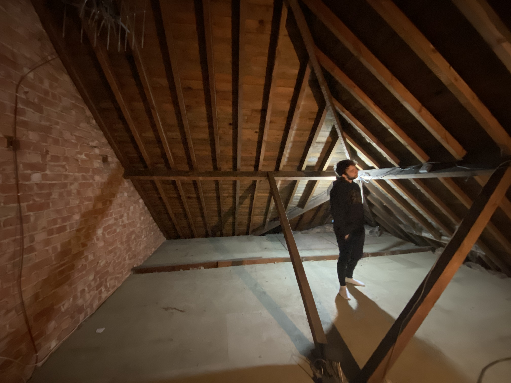

So, this is where it officially begins. Well, almost. We have to clear the fucking loft first. It's interesting to think why we kept all this shit if the first place it goes once it enters back into the house is directly in the bin. 

A river of boxes, suitcases and insulation from 1976 are blissfully lobbed down the stairs. Perhaps it's a good idea to think about where the stuff we **need** to keep is going to go after this is finished? _Nah._

