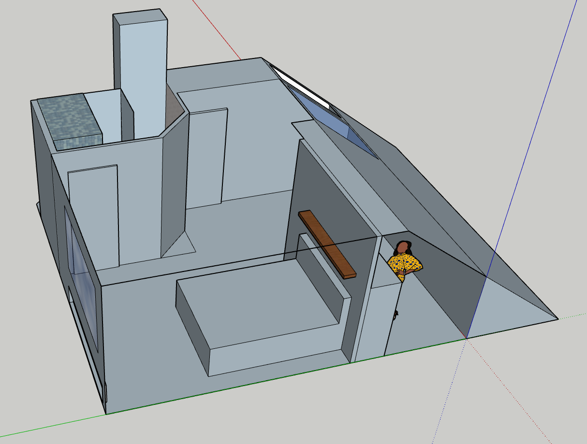

Well, that was not a healthy weekend. It's Tuesday morning, and we're on a serious Easter chocolate comedown. 

Between the takeaways and the alcohol, Scarlett and I managed to climb into the loft to carve out the floor plan. We used the only tape measure available which just so happened to be 1/3 of the length of any professional tape measure and bent in the middle. You might describe our measurements as "rough".

We moved to the computer and after far too long deciding just how tall the bed should be, we produced the initial design.

